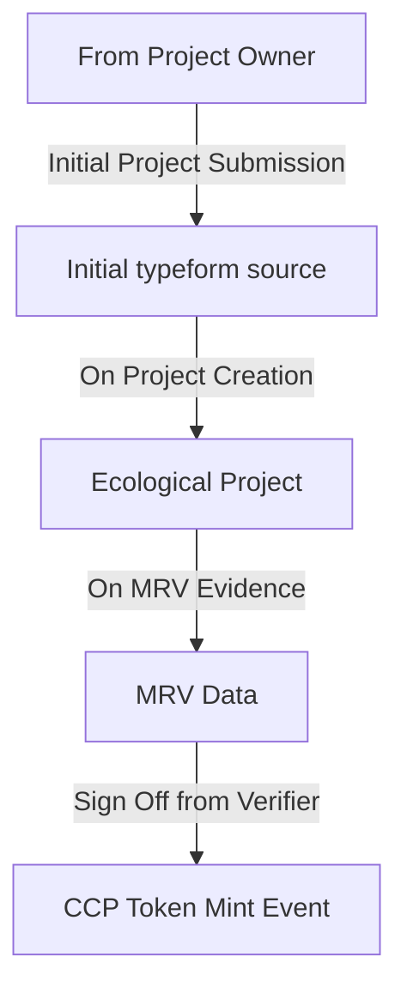

# DOVU Guardian Policies

The purpose of this repository is to act as a source of truth for all production policies that we create for our marketplace system. In addition, we'll add directions on specifications as well as recommendations for how policies should be processed for given payloads.

In short, we will add ongoing releases for policies we have internally created to utilise within our systems.

> If a policy has not been released with a viable link we can make the assumption that is currently in development. However, for our initial development we can make the assumption that there will be policies that are currently in development, this will be marked as "pre-release" in Github. 

The directory outline of the basic repository is as follows:

- Specifications
- Policies

Each directory will have its own readme file that will outline the sub-directory scope.

## Specifications

This folder is all about what specifications we are attempting to align to in order for us to make our policies compliant. In many respects we are trying to meet the mark of the IWA Standards, although initially we might be a little flexible.

You can expect to see all raw documentation as well as proto files of particular specifications for the entities we are working with.

## Policies

This folder focuses on our implementation of policies that attempts to meet the specific specifications, They will be broken down into subfolders to focus on each particular policy. You may see examples of Jason, as well as recommendations on how to process each step (especially document block submissions) in the policy.

# Understand DOVU's policies from a High-Level

DOVU's Aim is to provide the capability for tokenising carbon offsets, primarily through Hedera Hashgraph technology. To do this we want to create an engine that encapsulates the IWA Standard With a number of different steps:

1. A flexible form for the introduction of a project (Like the farmer onboarding form)
2. A block submission for an Ecological Project (EP)
3. A block submission for a given MRV measurement (Currently Agrecalc or Cool Farm Tool)
4. A [Core Carbon Principles (CCP)](https://icvcm.org/the-core-carbon-principles/) token is minted

With this in mind we have a view to follow this flow:

- A owner submits data to DOVU
- DOVU can process and begin the guardian submission 
- After internally processing DOVU converts to a project 
- Data initially sent to the guardian (create_application + create_farm)
- MRV data source document received from an owner/registrant
- Upon receives, pushed to the guardian, verifier needed.
- A verifier must confirm the project for the given MRV which triggers a mint event

We focus on using these structures:

- EP's (the project as they refer to projects with carbon removals)
- CCP (Tokens that are fungible in nature, and thus divisible for potential micro offsetting at a sub-kg scale)

## Current Progress and Needed Features

This is the current progress for these policies as at 26/07/22.

- The attached policies can receive the "onboarding DOVU information"
- Initial EP data, that we internally derive
- MRV submission data that we can submit
    - A policy ending with Agrecalc
    - A policy ending with Cool Farm Cool
- Verification is conducted by a verifier

However, these are a number of issues and features that are probably required for policies, we will work with IWA/Hedera on meeting compliance.

- Ensure that the full trust chain is signed off upon.
- Add a block after the minting step to show an instance of a CCP token
- Additional MRV elements for iOT/Satelite measurements (with a default authority for minting)

